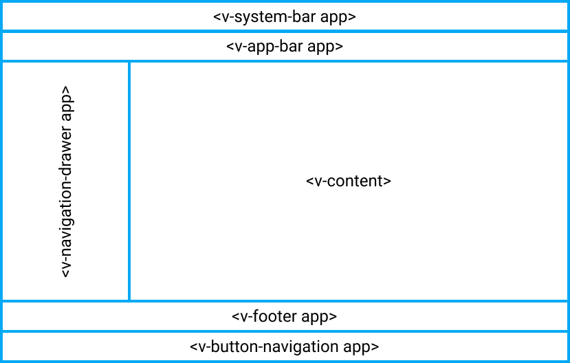
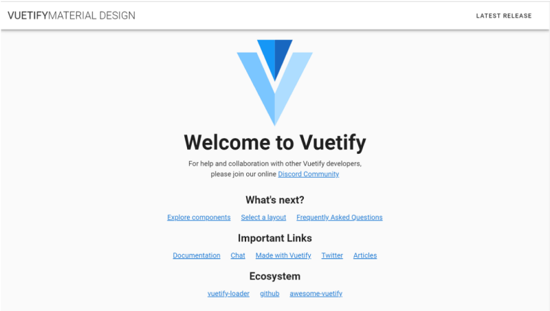
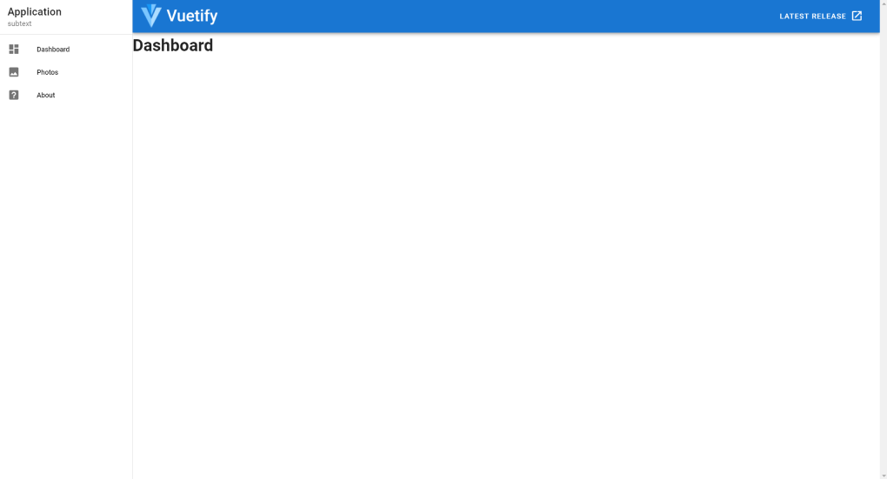
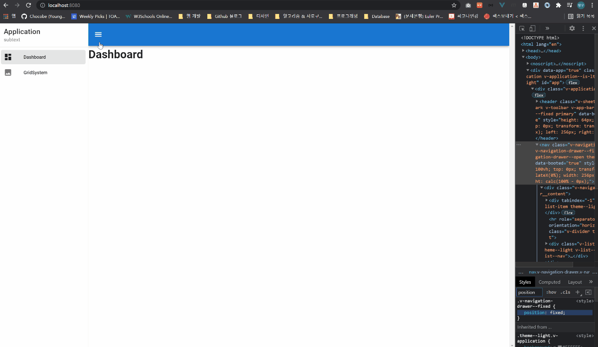
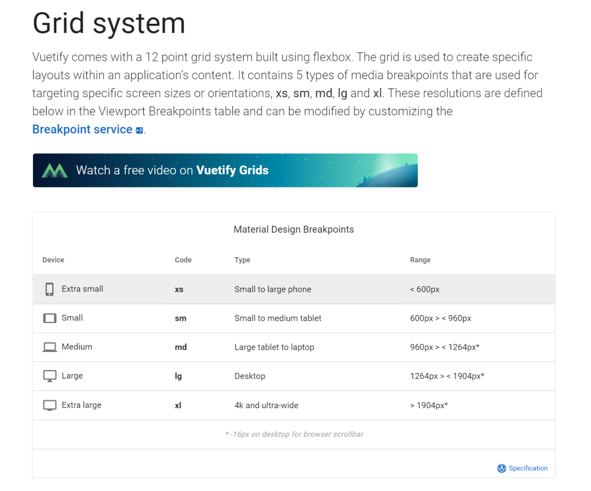
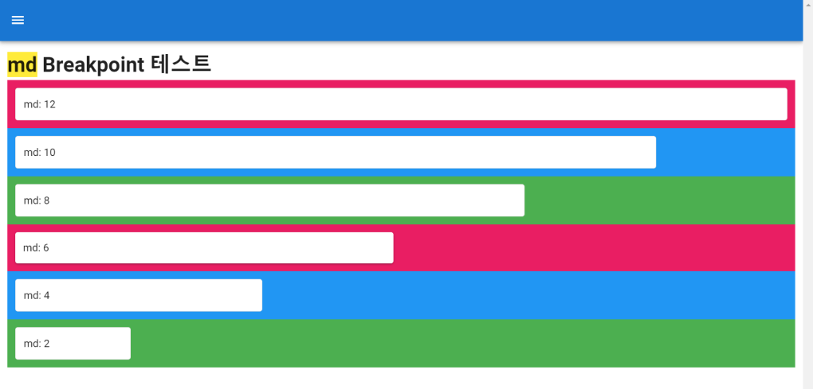
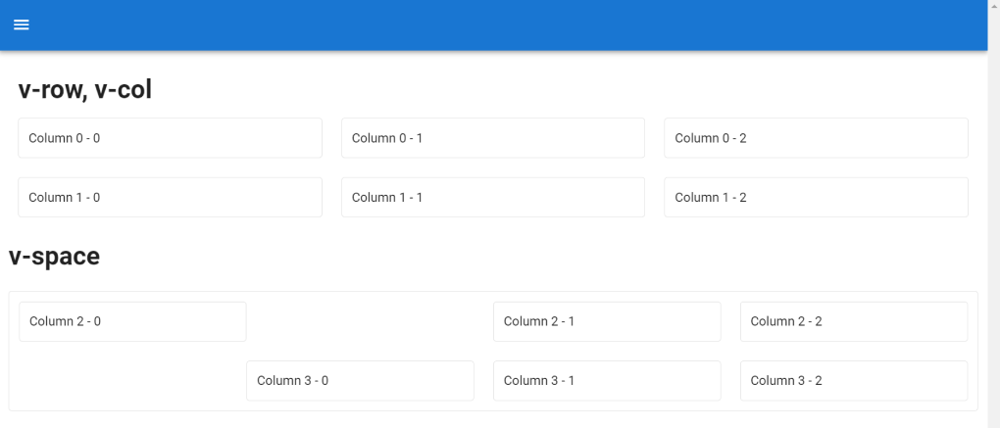
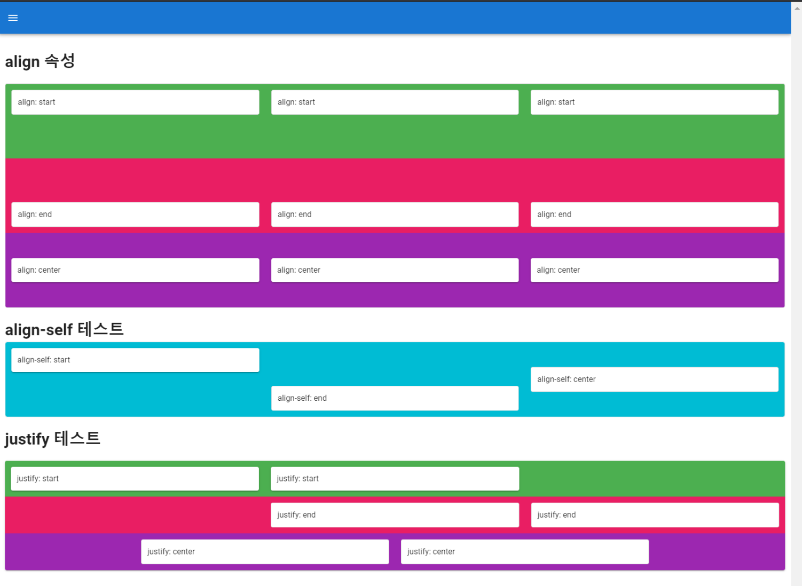
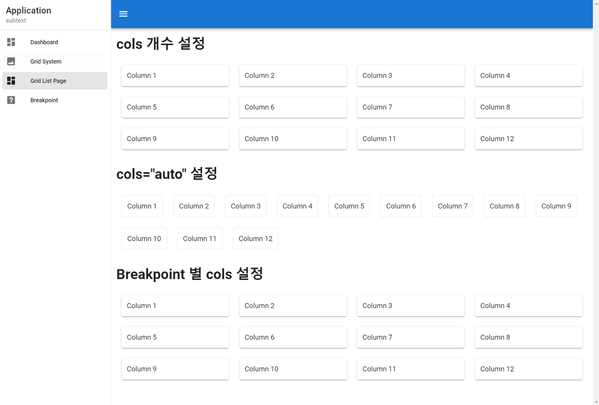

# Vuetify 기본

## ``Vuetify`` 란?

``Vuetify``는 ``Vue.js`` 프레임 워크에 특화된 ``UI 프레임워크`` 입니다.

``Material Design``을 기반으로 한 UI를 제공하며, 다른 UI 프레임워크와 차이점은 ``Vue Component``로 제공한다는 점 입니다.

``Vue Component``를 제공한다는 뜻은 다음과 같습니다.

```html
<template>
  <v-app>
    <v-app-bar app>
      <!-- ... -->
    </v-app-bar>

    <v-navigation-drawer app>
      <!-- ... -->
    </v-navigation-drawer>

    <v-main>
      <!-- ... -->
    </v-main>
  </v-app>
</template>
```


<br/><hr/><br/>


## 01. ``app`` 속성 Layout

Vuetify의 기본 Layout은 ``app`` 속성으로 설정할 수 있습니다.

``app`` 속성을 사용하면 다음과 같은 ``Layout``을 만들 수 있습니다.

(이하 ``Layout``은 아래 Layout 도식을 지칭합니다)

<br/>

<br/>

``Vuetify`` 프로젝트를 구성하는 ``Layout`` 컴포넌트는 다음과 같습니다.

* ``<v-app>``
    * 프로젝트의 ``Root`` 컴포넌트 입니다.
    * 프로그램이 실행될 때, ``진입점`` 역할을 합니다.

* ``<v-app-bar app>``
    * ``Header`` 컴포넌트 입니다.

* ``<v-navigation-drawer app>``
    * 좌측 메뉴 컴포넌트 입니다.

* ``<v-footer app>``
    * 푸터 컴포넌트 입니다.

* ``<v-main>``
    * 프로젝트상의 컨텐츠 영역 전체 Wrapper 컴포넌트 입니다.
    * 브라우저 랜더링 시, ``<main>`` 태그로 치환됩니다.

* ``<v-container>``
    * 실제 컨텐츠 Wrapper 컴포넌트 입니다.

<br/>

위의 ``Layout``은 프로젝트 최상위 컴포넌트인 ``App.vue``에 작성해야 합니다.

```html
<!-- App.vue -->

<template>
  <v-app>
    <!-- 헤더 컴포넌트 -->
    <v-app-bar app>
      <!-- v-app의 구성요소로써 동작하기 위해, "app" 속성 할당 -->
    </v-app-bar>

    <!-- 메뉴 컴포넌트 -->
    <v-navigation-drawer app>
      <!-- v-app의 구성요소로써 동작하기 위해, "app" 속성 할당 -->
    </v-navigation-drawer>

    <!-- main 컴포넌트 -->
    <v-main>
      <v-container>
        <!-- 컨텐츠 영역 -->
      </v-container>
    </v-main>

    <v-footer app>
      <!-- v-app의 구성요소로써 동작하기 위해, "app" 속성 할당 -->
    </v-footer>
  </v-app>
</template>
```


<br/><hr/><br/>


## 02. ``Vuetify`` 설치하기

생성한 Vue 프로젝트에 ``Vuetify``를 설치를 위해, 터미널에 다음 명령을 실행 합니다.

```bash
$ vue add vuetify
```

<br/>

설치가 완료된 후, 로컬 서버를 실행 하면 다음과 같은 결과를 확인할 수 있습니다.

<br/>


<br/><hr/><br/>


## 03. ``메뉴`` 만들기

``Layout``에서 ``메뉴``에 해당하는 부분은 ``<v-navigation-drawer app>`` 입니다.

[``Navigation Drawers``](https://vuetifyjs.com/en/components/navigation-drawers/)에서 필요한 소스코드를 사용할 수 있습니다.

사용할 소스코드는 ``app.vue``에서 다음 위치에 사용하면, ``Layout``의 ``<v-navigation-drawer app>``을 구현할 수 있습니다.

```html
<template>
	<v-app>
		<!-- 헤더 -->
		<v-app-bar app color="primary" dark>
			<!-- ... -->
		</v-app-bar>

		<!-- 메뉴 -->
		<!-- 삽입한 소스코드 -->
    <!-- 🐫 permanent 속성 삭제, app 속성 추가 -->
		<v-navigation-drawer app>
			<v-list-item>
				<v-list-item-content>
					<v-list-item-title class="title"> Application </v-list-item-title>
					<v-list-item-subtitle> subtext </v-list-item-subtitle>
				</v-list-item-content>
			</v-list-item>

			<v-divider></v-divider>

			<v-list dense nav>
				<v-list-item v-for="item in items" :key="item.title" link>
					<v-list-item-icon>
						<v-icon>{{ item.icon }}</v-icon>
					</v-list-item-icon>

					<v-list-item-content>
						<v-list-item-title>{{ item.title }}</v-list-item-title>
					</v-list-item-content>
				</v-list-item>
			</v-list>
		</v-navigation-drawer>

		<v-main>
			<router-view />
		</v-main>
	</v-app>
</template>
```

<br/>

``<template>``에서 참조하고 있는 데이터를 ``<script>``에 추가해 줍니다.

```html
<script>
import Vue from "vue";

export default {
  data: () => {
    items: [
      { title: 'Dashboard', icon: 'mdi-view-dashboard' },
      { title: 'Photos', icon: 'mdi-image' },
      { title: 'About', icon: 'mdi-help-box' },
    ],
    right: null,
  }
}
</script>
```

<br/>

지금까지의 결과는 다음과 같습니다.

<br/>

<br/>

현재 추가한 ``<v-navigation-drawer>`` 컴포넌트에는 ``router`` 기능이 없는 상태입니다.

``router`` 기능을 추가하기 전에, 사용할 페이지 2개를 생성해 보겠습니다.

1. ``Dashboard.vue``
2. ``GridSystem.vue``

```html
<!-- 경로: @/views/Dashboard.vue -->
<!-- router: "/" -->
<template>
  <div>
    <h1>Dashboard</h1>
  </div>
</template>

<script>
import Vue from "vue";

export default {
  //
}
</script>

<style></style>
```

<br/>

```html
<!-- 경로: @/views/GridSystem.vue -->
<!-- router: "/grid-system" -->
<template>
  <div>
    <h1>Grid System</h1>
  </div>
</template>

<script>
import Vue from "vue";

export default {
  //
}
</script>

<style></style>
```

<br/>

이제 우리가 만든 페이지를 ``<v-navigation-drawer>``에서 ``router``로 사용할 수 있도록 ``app.vue``를 수정해 보겠습니다.

``router`` 기능을 할 실제 컴포넌트는 ``<v-list-item>`` 컴포넌트 이며, 해당 문서를 참고하여 ``router`` 기능을 구현할 수 있습니다.

> [``🐫 <v-list-item> 메뉴얼: https://vuetifyjs.com/en/api/v-list-item/#props-to``](https://vuetifyjs.com/en/api/v-list-item/#props-to)

<br/>

```html
<template>
	<v-app>
		<!-- 헤더 -->
		<v-app-bar app color="primary" dark>
			<!-- ... -->
		</v-app-bar>

		<!-- 메뉴 -->
		<!-- 삽입한 소스코드 -->
		<v-navigation-drawer app>
			<v-list-item>
				<v-list-item-content>
					<v-list-item-title class="title"> Application </v-list-item-title>
					<v-list-item-subtitle> subtext </v-list-item-subtitle>
				</v-list-item-content>
			</v-list-item>

			<v-divider></v-divider>

			<v-list dense nav>
				<!-- 🐫 :to 속성 추가 -->
				<v-list-item v-for="item in items" :key="item.title" :to="item.to" link>
					<v-list-item-icon>
						<v-icon>{{ item.icon }}</v-icon>
					</v-list-item-icon>

					<v-list-item-content>
						<v-list-item-title>{{ item.title }}</v-list-item-title>
					</v-list-item-content>
				</v-list-item>
			</v-list>
		</v-navigation-drawer>

		<v-main>
			<router-view />
		</v-main>
	</v-app>
</template>

<script>
import Vue from "vue";

export default {
  data: () => {
    items: [
      { 
        title: 'Dashboard', 
        icon: 'mdi-view-dashboard',
        to: "/",
      },
      { 
        title: 'Grid System',
        icon: 'mdi-image',
        to: "/grid-system",
      },
    ],
    right: null,
  }
}
</script>
```

<br/>

지금까지의 결과는 다음과 같습니다.

<br/>


<br/><hr/><br/>


## 04. ``Hammburger 버튼`` 만들기 (메뉴버튼)

``<v-navigation-drawer>`` 컴포넌트의 ``v-model`` 기본값은 ``null`` 입니다.

``v-model="null"`` 일 경우, 다음과 같이 동작 합니다.

1. 모바일 화면: ``v-model="true"`` 일 때, ``overlay`` 방식으로 출력됩니다.
2. 데스트탑 화면: ``v-model="true"`` 일 때, ``Flex Item`` 방식으로 출력 됩니다. (코드 상 position: ``fixed``)

> [<v-navigation-drawer>의 상태값: https://vuetifyjs.com/en/components/navigation-drawers/#usage](https://vuetifyjs.com/en/components/navigation-drawers/#usage)

<br/>

현재 ``<v-navigation-drawer>``의 ``v-model`` 은 설정하지 않았으므로 ``null`` 상태이며, 모바일 화면에서는 메뉴를 볼 수 없습니다.

이를 해결하기 위해, ``<v-app-bar> (헤더)``에 ``<v-app-bar-nav-icon> (메뉴 아이콘)``을 만들고 ``@click`` 이벤트를 사용하여 메뉴 버튼을 구현하겠습니다.

<br/>

먼저 ``app.vue``의 ``<script>``에 ``isDrawer: boolean (메뉴 상태값)``을 만들고, ``toggleMenu()`` 함수를 만들어 줍니다.

```html
<script>
export default {
  data: () => ({
    // ... 생략

    // 메뉴 상태값
    isDrawer: false,
  }),

  methods: {
    // ... 생략

    // 메뉴 상태값 토글 함수
    toggleMenu() {
      this.isDrawer = !this.isDrawer;
    }
  }
}
</script>
```

<br/>

작성한 함수를 ``<v-app-bar-nav-icon>`` 의 ``@click`` 이벤트에 연결해 주고, ``isDrawer`` 상태값을 ``<v-navigation-drawer>`` 의 ``v-model``에 바인딩 시켜 줍니다.

```html
<template>
  <v-app>
    <v-app-bar app color="primary" dark>
      <!-- 🐫 @click 이벤트에 toggleMenu() 함수 바인딩 -->
      <v-app-bar-nav-icon @click="toggleMenu"></v-app-bar-nav-icon>
    </v-app-bar>

    <!-- 🐫 v-model에 isDrawer 상태값 바인딩 -->
    <v-navigation-drawer v-model="isDrawer" app>
      <!-- ... 생략 ... -->
    </v-navigation-drawer>
  </v-app>>
</template>
```

<br/>

작성 후, 로컬 서버를 실행하면 메뉴 버튼이 동작하는 것을 볼 수 있습니다.

<br/>


<br/><hr/><br/>


## 05. ``Vuetify ESLint`` 설정

``Vuetify``는 ``2.x`` 기준으로 컴포넌트 사용법이 다수 변경 되었습니다.

때문에 ``2.x 이상`` 버전에서 ``2.x 미만`` 문법에 대한 코딩 컨벤션이 달라지게 되는데, 이를 보정하기 위해 ``eslint-plugin-vuetify`` 를 사용 합니다.

<br/>

먼저 ``eslint-plugin-vuetify`` 를 설치 합니다.

```bash
$ npm i eslint-plugin-vuetify
```

<br/>

설치가 완료된 후, ``.eslintrc.js``에 ``eslint-plugin-vuetify`` 설정을 추가해 줍니다.

```javascript
// .eslintrc.js
module.exports = {
  // ... 생략
  extends: [
    // ... 생략
    
    "plugin:vue/base",
    // 또는 "plugin:vue/essential"
    // 또는 "plugin:vue/recommended"
  ],

  plugins: [
    // ... 생략

    "vuetify",
  ],

  rules: {
    // ... 생략

    "vuetify/no-deprecated-classes": "error",
  },
};
```

<br/>

위의 설정이 완료된 ``.eslintrc.js`` 파일은 다음과 같습니다.

```javascript
module.exports = {
	root: true,
	env: {
		node: true,
	},
	extends: [
		// "plugin:vue/essential",
		"plugin:vue/recommended",
		"eslint:recommended",
		"@vue/prettier",
	],
	plugins: ["vuetify"],
	parserOptions: {
		parser: "babel-eslint",
	},
	rules: {
		"no-console": process.env.NODE_ENV === "production" ? "warn" : "off",
		"no-debugger": process.env.NODE_ENV === "production" ? "warn" : "off",
		"no-var": "error",
		"prefer-const": "error",
		"vuetify/no-deprecated-classes": "error",

		"prettier/prettier": [
			"error",
			{
				singleQuote: false,
				semi: true,
				useTabs: true,
				tabWidth: 2,
				trailingComma: "all",
				printWidth: 100,
				bracketSpacing: true,
				arrowParens: "avoid",
			},
		],
	},
};
```


<br/><hr/><br/>


## 06. ``Vuetify``의 ``Grid System`` 개념

UI Framework 에는 ``Grid System`` 개념을 가지고 있습니다.

``Grid System``은 ``레이아웃``을 만들기 위한 규격과 사용방법을 나타냅니다.

이러한 ``Grid System``을 사용하는 이유는 다음과 같습니다.

1. 컨텐츠의 ``정렬``과 ``정돈``
2. ``일관적``이고 ``규칙적인`` 디자인
3. ``디자인 가이드``와 ``협업``에 도움
4. 쉬운 ``반응형 디자인 설계``

<br/>

``Vuetify``는 Google의 ``Material Dsign``을 기반으로 하고 있습니다.

> [Material Design 홈페이지: https://material.io/design/layout/responsive-layout-grid.html#columns-gutters-and-margins](https://material.io/design/layout/responsive-layout-grid.html#columns-gutters-and-margins)

``Vuetify``의 ``Grid System`` 특징은 다음과 같습니다.

1. ``Flex Box``를 사용하여 구축되었습니다.
2. ``12 Column`` Grid를 사용 합니다.
3. ``5가지 Breakpoint``를 가집니다.

<br/>

여기서 ``Breakpoint``는 ``종단점``의 개념으로 ``반응형 디자인``의 ``@media`` 범위를 나타냅니다.

> [Vuetify Breakpoint: https://vuetifyjs.com/en/components/grids/](https://vuetifyjs.com/en/components/grids/)

<br/>

<br/>

위의 가이드에 따르면 ``md`` 스펙의 Viewport에서는 ``하나의 Row``에 ``12개 Column``이 존재 합니다.

만약 ``md`` Viewport일 때, 12개의 Column 중, ``4개 Column`` 만큼 영역을 할당 하려면, 해당 ``v-col``의 ``md``속성으로 지정할 수 있습니다.

```html
<v-row>
  <v-col md="4">
    <!-- ... 생략 ... --->
  </v-col>
</v-row>
```

<br/>

위의 예시를 사용하여, ``md``개수별 예시를 만들면 다음과 같습니다.

```html
<template>
	<div>
		<h1><span class="yellow">md</span> Breakpoint 테스트</h1>

		<v-container fluid>
			<v-row class="pink">
				<v-col md="12">
					<v-card class="pa-3" outlined> md: 12 </v-card>
				</v-col>
			</v-row>

			<v-row class="blue">
				<v-col md="10">
					<v-card class="pa-3" outlined> md: 10 </v-card>
				</v-col>
			</v-row>

			<v-row class="green">
				<v-col md="8">
					<v-card class="pa-3" outlined> md: 8 </v-card>
				</v-col>
			</v-row>

			<v-row class="pink">
				<v-col md="6">
					<v-card class="pa-3"> md: 6 </v-card>
				</v-col>
			</v-row>

			<v-row class="blue">
				<v-col md="4">
					<v-card class="pa-3" outlined> md: 4 </v-card>
				</v-col>
			</v-row>

			<v-row class="green">
				<v-col md="2">
					<v-card class="pa-3" outlined> md: 2 </v-card>
				</v-col>
			</v-row>
		</v-container>
	</div>
</template>
```

<br/>

<br/>


<br/><hr/><br/>


## 07. ``Grid System``으로 배치되는 ``v-row`` 와 ``v-col``

위에서 설명한 ``Grid System`` 개념이 반영된 컴포넌트는 다음과 같습니다.

1. ``v-container``
      * 컴텐츠의 폭을 나타내며, 웹사이트의 컨텐츠를 중앙에 배치합니다.

2. ``v-row``
      * Grid의 ``Row`` 역할을 하며, ``v-col``을 하위 컴포넌트로 가집니다. 
      * ``v-col`` 컴포넌트의 ``레이아웃 제어`` 기능을 가집니다.

3. ``v-col``
      * 화면에 출력할 실제 컨텐츠 (v-card 등)을 하위 컴포넌트로 가집니다.
      * ``v-row``의 하위 컴포넌트로 위치해야 합니다.

4. ``v-spacer``
      * 컴포넌트간 간격을 만들어 줍니다.

<br/>

위의 요소들을 사용하면 다음과 같이 사용할 수 있습니다.

```html
<template>
	<div>
		<v-container fluid>
			<!-- v-row, v-col 테스트 -->
			<h1 class="mb-3">v-row, v-col</h1>
			<v-row>
				<v-col>
					<v-card class="pa-3" outlined> Column 0 - 0 </v-card>
				</v-col>

				<v-col>
					<v-card class="pa-3" outlined> Column 0 - 1 </v-card>
				</v-col>

				<v-col>
					<v-card class="pa-3" outlined> Column 0 - 2 </v-card>
				</v-col>
			</v-row>

			<v-row>
				<v-col>
					<v-card class="pa-3" outlined> Column 1 - 0 </v-card>
				</v-col>

				<v-col>
					<v-card class="pa-3" outlined> Column 1 - 1 </v-card>
				</v-col>

				<v-col>
					<v-card class="pa-3" outlined> Column 1 - 2 </v-card>
				</v-col>
			</v-row>
		</v-container>

		<!-- v-space 테스트 -->
		<h1 class="mt-3">v-space</h1>

		<v-card class="mt-5 pa-3" outlined>
			<v-row>
				<v-col>
					<v-card class="pa-3" outlined> Column 2 - 0 </v-card>
				</v-col>

				<v-spacer></v-spacer>

				<v-col>
					<v-card class="pa-3" outlined> Column 2 - 1 </v-card>
				</v-col>

				<v-col>
					<v-card class="pa-3" outlined> Column 2 - 2 </v-card>
				</v-col>
			</v-row>

			<v-row>
				<v-spacer></v-spacer>

				<v-col>
					<v-card class="pa-3" outlined> Column 3 - 0 </v-card>
				</v-col>

				<v-col>
					<v-card class="pa-3" outlined> Column 3 - 1 </v-card>
				</v-col>

				<v-col>
					<v-card class="pa-3" outlined> Column 3 - 2 </v-card>
				</v-col>
			</v-row>
		</v-card>
  </div>
</template>
```

<br/>

<br/>


<br/><hr/><br/>


## 08. ``v-row`` 와 ``v-col``의 ``justify-content``, ``align-items``, ``align-self`` 설정

``v-row``는 ``Flex Box`` 속성을 가지고 있고, ``v-col``은 ``Flex Item`` 속성을 가지고 있습니다.

따라서, ``flex``의 하위속성인 ``justify-content``와 ``align-items``를 설정할 수 있습니다.

<br/>

``justify-content``와 ``align-items``는 ``Flex Box``의 하위 속성이므로, ``v-row``에서 설정할 수 있습니다.

```html
<v-row justify="start"></v-row>

<v-row justify="center"></v-row>

<v-row justify="end"></v-row>

<v-row justify="space-between"></v-row>

<v-row justify="space-around"></v-row>
```

<br/>

```html
<v-row align="start"></v-row>

<v-row align="center"></v-row>

<v-row align="end"></v-row>
```

<br/>

```html
<v-row style="height: 150px">
  <v-col align-self="start"></v-col>
</v-row>

<v-row style="height: 150px">
  <v-col align-self="center"></v-col>
</v-row>

<v-row style="height: 150px">
  <v-col align-self="end"></v-col>
</v-row>
```

<br/>

위의 예시를 사용하면 다음과 같습니다.

```html
<template>
	<div>
		<!-- align 속성 테스트 -->
		<h1 class="mt-5">align 속성</h1>

		<v-card class="mt-5 pa-3" outlined>
			<v-row class="green" style="height: 150px">
				<v-col>
					<v-card class="pa-3" outlined>align: start</v-card>
				</v-col>

				<v-col>
					<v-card class="pa-3" outlined>align: start</v-card>
				</v-col>

				<v-col>
					<v-card class="pa-3" outlined>align: start</v-card>
				</v-col>
			</v-row>

			<v-row class="pink" style="height: 150px" align="end">
				<v-col>
					<v-card class="pa-3" outlined>align: end</v-card>
				</v-col>

				<v-col>
					<v-card class="pa-3" outlined>align: end</v-card>
				</v-col>

				<v-col>
					<v-card class="pa-3" outlined>align: end</v-card>
				</v-col>
			</v-row>

			<v-row class="purple" style="height: 150px" align="center">
				<v-col>
					<v-card class="pa-3"> align: center </v-card>
				</v-col>

				<v-col>
					<v-card class="pa-3"> align: center </v-card>
				</v-col>

				<v-col>
					<v-card class="pa-3"> align: center </v-card>
				</v-col>
			</v-row>
		</v-card>

		<!-- align-self 테스트 -->
		<h1 class="mt-5">align-self 테스트</h1>

		<v-card class="pa-3" outlined>
			<v-row class="cyan" style="height: 150px">
				<v-col align-self="start">
					<v-card class="pa-3"> align-self: start </v-card>
				</v-col>

				<v-col align-self="end">
					<v-card class="pa-3" outlined> align-self: end </v-card>
				</v-col>

				<v-col align-self="center">
					<v-card class="pa-3" outlined> align-self: center </v-card>
				</v-col>
			</v-row>
		</v-card>

		<!-- justify 테스트 -->
		<h1 class="mt-5">justify 테스트</h1>

		<v-card class="mt-5 pa-3">
			<v-row class="green" justify="start">
				<v-col md="4">
					<v-card class="pa-3"> justify: start </v-card>
				</v-col>

				<v-col md="4">
					<v-card class="pa-3"> justify: start </v-card>
				</v-col>
			</v-row>

			<v-row class="pink" justify="end">
				<v-col md="4">
					<v-card class="pa-3" outlined> justify: end </v-card>
				</v-col>

				<v-col md="4">
					<v-card class="pa-3" outlined> justify: end </v-card>
				</v-col>
			</v-row>

			<v-row class="purple" justify="center">
				<v-col md="4">
					<v-card class="pa-3" outlined> justify: center </v-card>
				</v-col>

				<v-col md="4">
					<v-card class="pa-3" outlined> justify: center </v-card>
				</v-col>
			</v-row>
		</v-card>
	</div>
</template>
```

<br/>

<br/>


<br/><hr/><br/>


## 09. ``v-col``의 ``cols`` 속성과 ``Breakpoint``

``v-col``은 ``v-row``에서 몇개의 ``Column`` 영역을 가질 것인지 설정할 수 있습니다.

이 설정이 ``cols`` 입니다.

``cols``에 설정한 ``Column 개수``는 ``xs`` Breakpoint에서 Column 개수이며, ``cols="auto"``를 설정할 경우에는 ``v-col``의 컨텐츠 크기만큼만 영역을 차지하게 됩니다.

<br/>

``v-col``의 ``cols`` 속성을 사용하면 다음과 같습니다.

```html
<template>
	<div>
		<!-- cols 개수 설정 -->
		<h1>cols 개수 설정</h1>

		<v-container class="mt-3" fluid>
			<v-row>
				<template v-for="i in 12">
					<v-col :key="i" cols="12" sm="6" md="4" lg="3">
						<v-card class="pa-3"> Column {{ i }} </v-card>
					</v-col>
				</template>
			</v-row>
		</v-container>

		<!-- cols="auto" 설정 -->
		<h1 class="mt-5">cols="auto" 설정</h1>

		<v-container class="mt-3" fluid>
			<v-row>
				<template v-for="i in 12">
					<v-col :key="i" cols="auto">
						<v-card class="pa-3" outlined> Column {{ i }} </v-card>
					</v-col>
				</template>
			</v-row>
		</v-container>

		<!-- Breakpoint 별 cols 설정 -->
		<h1 class="mt-5">Breakpoint 별 cols 설정</h1>

		<v-container class="mt-3" fluid>
			<v-row>
				<template v-for="i in 12">
					<v-col :key="i" cols="2" sm="6" md="4" lg="3" xl="1">
						<v-card class="pa-3"> Column {{ i }} </v-card>
					</v-col>
				</template>
			</v-row>
		</v-container>
	</div>
</template>
```

<br/>

<br/>


<br/><hr/><br/>


